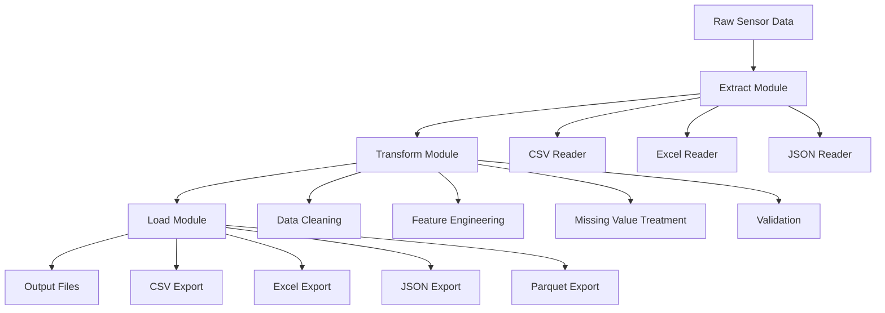

# 📚 Dokumentasi Lengkap - ETL Sensor Data dengan Pandas

## 🎯 Overview
Proyek ini menyediakan tutorial hands-on lengkap untuk melakukan Extract, Transform, Load (ETL) pada data sensor IoT menggunakan Python Pandas. Tutorial ini dirancang untuk memberikan pengalaman praktis dalam pengolahan data real-world dengan berbagai tantangan yang umum ditemui.

## 🏗️ Arsitektur Sistem



## 📁 Struktur Project

```
ETL-Pandas/
├── README.md                           # Overview dan quick start
├── requirements.txt                    # Dependencies
├── quick_start.py                     # Setup otomatis
│
├── data/                              # Data directory
│   ├── raw/                          # Data mentah
│   │   ├── sensor_data_main.csv     # Data CSV utama
│   │   ├── sensor_data_monthly.xlsx # Data Excel bulanan
│   │   ├── sensor_config.json       # Konfigurasi sensor
│   │   └── sensor_data_semicolon.csv # CSV dengan separator berbeda
│   ├── processed/                    # Data intermediate
│   └── output/                       # Hasil akhir ETL
│
├── notebooks/                         # Jupyter notebooks
│   ├── 01_ETL_Sensor_Data_Tutorial.ipynb    # Tutorial utama
│   └── 02_Advanced_Sensor_Analysis.ipynb   # Analisis lanjutan
│
├── scripts/                          # Python scripts
│   ├── generate_sample_data.py      # Generate data simulasi
│   └── etl_pipeline.py              # ETL pipeline otomatis
│
├── utils/                            # Utility functions
│   ├── __init__.py                  # Package init
│   └── sensor_utils.py              # Helper functions
│
└── config/                           # Configuration files
    └── etl_config.json              # ETL configuration
```

## 🚀 Quick Start

### 1. Setup Environment
```bash
# Clone atau download project
cd ETL-Pandas

# Install dependencies
pip install -r requirements.txt

# Run quick start (otomatis setup semua)
python quick_start.py
```

### 2. Manual Setup
```bash
# Generate sample data
python scripts/generate_sample_data.py

# Run ETL pipeline
python scripts/etl_pipeline.py

# Launch Jupyter Notebook
jupyter notebook 01_ETL_Sensor_Data_Tutorial.ipynb
```

## 📊 Dataset Description

### Sensor Data Schema
| Column | Type | Description | Range |
|--------|------|-------------|--------|
| `timestamp` | datetime | Waktu pembacaan sensor | 2024-01-01 to 2024-03-01 |
| `sensor_id` | string | Unique identifier sensor | SENSOR_001 to SENSOR_010 |
| `location` | string | Lokasi pemasangan | Location_A to Location_E |
| `temperature_celsius` | float | Suhu dalam Celsius | -10°C to 50°C |
| `humidity_percent` | float | Kelembaban relatif | 0% to 100% |
| `pressure_hpa` | float | Tekanan atmosfer | 950 to 1050 hPa |
| `air_quality_aqi` | float | Indeks kualitas udara | 0 to 300 AQI |
| `status` | string | Status sensor | active, maintenance |

### Data Quality Issues (Disimulasikan)
- **Missing Values**: ~2-3% missing data pada sensor readings
- **Outliers**: ~1% values ekstrim di luar range normal
- **Duplicates**: ~0.5% duplicate records
- **Inconsistent Formatting**: Mixed case pada location names
- **Time Series Gaps**: Occasional missing timestamps

## 🔧 ETL Pipeline Components

### 1. Extract (E)
- **CSV Reading**: Pandas `read_csv()` dengan berbagai separators
- **Excel Reading**: Multi-sheet processing dengan `read_excel()`
- **JSON Processing**: Metadata dan configuration files
- **Error Handling**: Graceful handling untuk missing files

### 2. Transform (T)

#### Data Cleaning
- Duplicate removal
- Column name standardization
- Data type conversion
- Categorical data normalization

#### Time Series Processing
- Datetime parsing dan validation
- Time zone handling
- Time-based feature extraction (hour, day, week, season)
- Time period categorization

#### Feature Engineering
- **Temperature Conversions**: Celsius ↔ Fahrenheit ↔ Kelvin
- **Heat Index**: Comfort level calculation
- **Air Quality Categories**: AQI to descriptive categories
- **Comfort Index**: Combined temperature-humidity comfort score
- **Rolling Statistics**: Moving averages dan trends
- **Sensor Performance Metrics**: Uptime, reliability scores

#### Missing Value Treatment
- **Forward Fill**: Untuk time series continuity
- **Interpolation**: Linear interpolation untuk gaps
- **Group-based Imputation**: Mean/median by location atau sensor
- **Domain-specific**: Logical defaults untuk categorical

#### Data Validation
- Range checking untuk sensor readings
- Outlier detection (IQR, Z-score methods)
- Consistency validation
- Quality scoring (0-100 scale)

### 3. Load (L)
- **CSV Export**: Standard comma-separated format
- **Excel Export**: Multi-sheet dengan summary dan aggregations
- **JSON Export**: For API consumption
- **Parquet Export**: Efficient columnar format untuk big data
- **Metadata Export**: Processing logs dan data quality reports

## 🛠️ Utility Functions

### Data Quality Assessment
```python
from utils.sensor_utils import calculate_data_quality_score

quality_scores = calculate_data_quality_score(df)
# Returns: completeness, uniqueness, validity, consistency scores
```

### Anomaly Detection
```python
from utils.sensor_utils import detect_anomalies

anomalies = detect_anomalies(df, 'temperature_celsius', method='iqr')
```

### Visualization
```python
from utils.sensor_utils import plot_sensor_trends, plot_correlation_heatmap

plot_sensor_trends(df)
plot_correlation_heatmap(df)
```

### Data Validation
```python
from utils.sensor_utils import validate_sensor_data

validation_results = validate_sensor_data(df)
```

## 📈 Advanced Analysis Features

### 1. Time Series Analysis
- Trend detection dan seasonal decomposition
- Moving averages dan smoothing
- Autocorrelation analysis
- Forecasting preparation

### 2. Sensor Performance Monitoring
- Uptime calculation
- Drift detection
- Maintenance period identification
- Performance benchmarking

### 3. Multi-sensor Correlation
- Cross-sensor relationship analysis
- Environmental factor correlation
- Location-based comparisons
- Time-based pattern analysis

### 4. Data Quality Monitoring
- Real-time quality metrics
- Automated anomaly flagging
- Quality trend analysis
- Alert system integration

## 🎛️ Configuration

### ETL Config (`config/etl_config.json`)
```json
{
  "processing": {
    "remove_duplicates": true,
    "handle_missing": true,
    "feature_engineering": true,
    "normalize_data": true
  },
  "sensor_ranges": {
    "temperature_celsius": [-50, 60],
    "humidity_percent": [0, 100]
  },
  "export_formats": ["csv", "excel", "json"],
  "quality_thresholds": {
    "completeness_min": 90,
    "validity_min": 95
  }
}
```

## 🚦 Best Practices

### 1. Data Processing
- Always validate input data before processing
- Use appropriate data types untuk memory efficiency
- Implement proper error handling
- Log all processing steps untuk auditing

### 2. Performance Optimization
- Use vectorized operations (avoid loops)
- Leverage pandas built-in functions
- Consider chunking untuk large datasets
- Profile code untuk bottleneck identification

### 3. Data Quality
- Implement multiple validation layers
- Use domain knowledge untuk realistic range checks
- Document all assumptions dan decisions
- Create reproducible processing pipelines

### 4. Documentation
- Comment complex transformations
- Document feature engineering logic
- Maintain data dictionaries
- Version control all configurations

## 🔍 Troubleshooting

### Common Issues

#### 1. Memory Issues
```python
# Solution: Use chunking
chunksize = 10000
for chunk in pd.read_csv('large_file.csv', chunksize=chunksize):
    process_chunk(chunk)
```

#### 2. Performance Issues
```python
# Solution: Use efficient data types
df['sensor_id'] = df['sensor_id'].astype('category')
df['temperature'] = pd.to_numeric(df['temperature'], downcast='float')
```

#### 3. Missing Data Handling
```python
# Check missing pattern
missing_pattern = df.isnull().sum()
missing_percentage = (missing_pattern / len(df)) * 100
```

### Error Messages dan Solutions

| Error | Cause | Solution |
|-------|-------|----------|
| `FileNotFoundError` | Missing input files | Run `generate_sample_data.py` first |
| `MemoryError` | Dataset too large | Use chunking atau sampling |
| `ValueError: Invalid range` | Sensor values out of bounds | Check data quality dan outliers |
| `KeyError: column not found` | Missing expected columns | Verify data schema |

## 🧪 Testing

### Unit Tests
```python
# Test data validation
def test_sensor_validation():
    test_df = create_test_data()
    results = validate_sensor_data(test_df)
    assert results['temperature_celsius']['validity_percentage'] > 90

# Test feature engineering
def test_feature_engineering():
    test_df = create_test_data()
    processed_df = add_features(test_df)
    assert 'temperature_fahrenheit' in processed_df.columns
```

### Integration Tests
- End-to-end pipeline testing
- Data quality validation
- Performance benchmarking
- Output format validation

## 📊 Performance Benchmarks

### Typical Processing Times
| Dataset Size | Processing Time | Memory Usage |
|--------------|----------------|---------------|
| 10K records | 2-3 seconds | 50 MB |
| 100K records | 15-20 seconds | 200 MB |
| 1M records | 2-3 minutes | 1 GB |

### Optimization Tips
1. Use categorical data types untuk string columns
2. Implement parallel processing untuk large datasets
3. Use appropriate indexing
4. Consider database storage untuk very large datasets

## 🔄 Production Deployment

### Scheduling
```bash
# Crontab example: Run ETL daily at 2 AM
0 2 * * * /path/to/python /path/to/etl_pipeline.py
```

### Monitoring
- Data quality alerts
- Processing time monitoring
- Error rate tracking
- Output size validation

### Scaling
- Distributed processing dengan Dask
- Database integration
- Cloud storage integration
- API endpoints untuk real-time processing

## 📚 Learning Path

### Beginner Level
1. Complete `01_ETL_Sensor_Data_Tutorial.ipynb`
2. Understand basic pandas operations
3. Practice dengan different data formats
4. Learn basic data cleaning techniques

### Intermediate Level
1. Explore `02_Advanced_Sensor_Analysis.ipynb`
2. Implement custom feature engineering
3. Work dengan time series analysis
4. Create custom visualization functions

### Advanced Level
1. Optimize pipeline untuk large datasets
2. Implement real-time processing
3. Add machine learning integration
4. Build production-ready solutions

## 🤝 Contributing

### How to Contribute
1. Fork the repository
2. Create feature branch
3. Add tests untuk new functionality
4. Update documentation
5. Submit pull request

### Development Setup
```bash
# Clone repo
git clone <repository>

# Install development dependencies
pip install -r requirements-dev.txt

# Run tests
python -m pytest tests/
```

## 📞 Support

### Getting Help
- Check dokumentasi dan troubleshooting section
- Review existing issues di repository
- Create detailed bug reports dengan reproducible examples
- Join community discussions

### Reporting Issues
Include:
- Python version dan pandas version
- Complete error messages
- Sample data (anonymized)
- Steps to reproduce
- Expected vs actual behavior

## 📜 License
This project is licensed under the MIT License - see LICENSE file for details.

## 🙏 Acknowledgments
- Pandas development team
- Open source community
- Contributors dan testers
- Educational institutions using this material